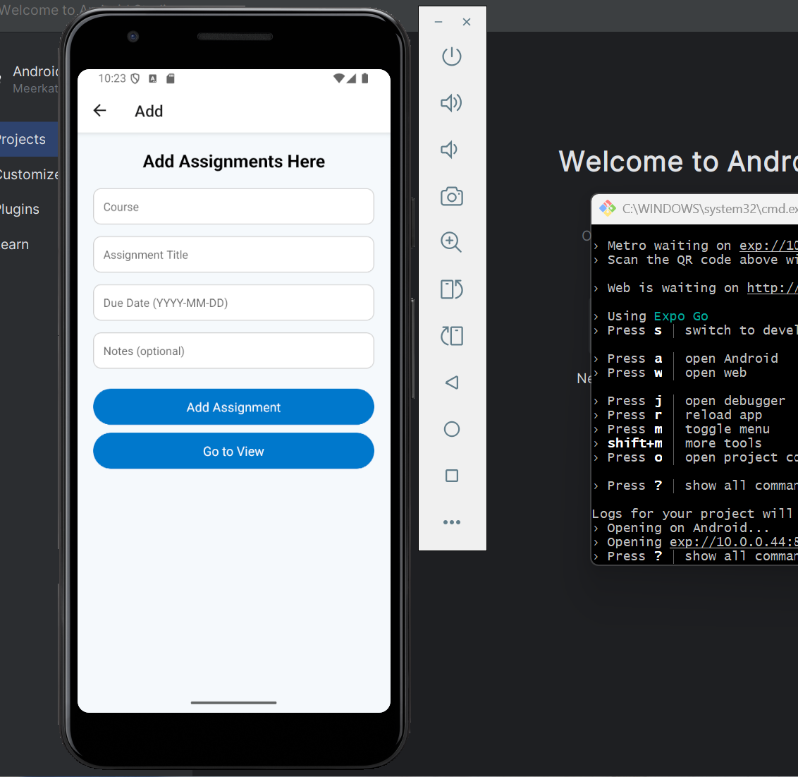
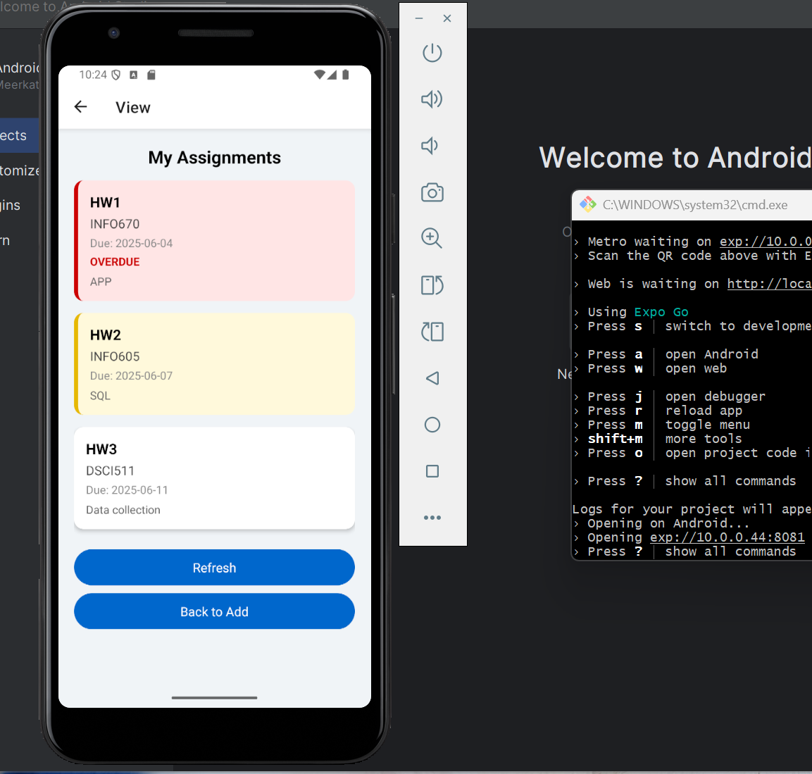
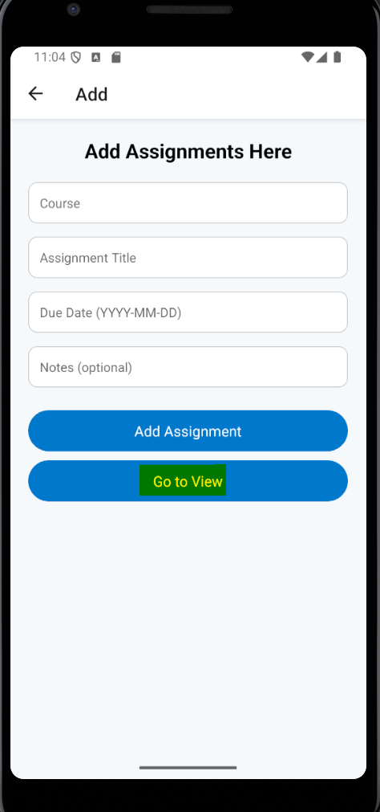
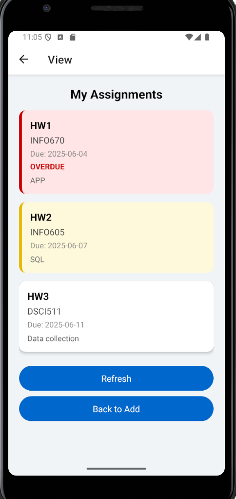
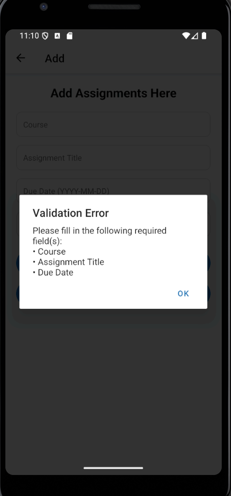
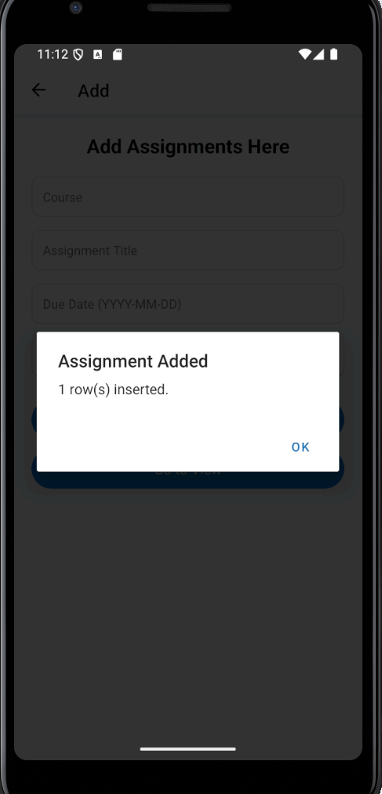
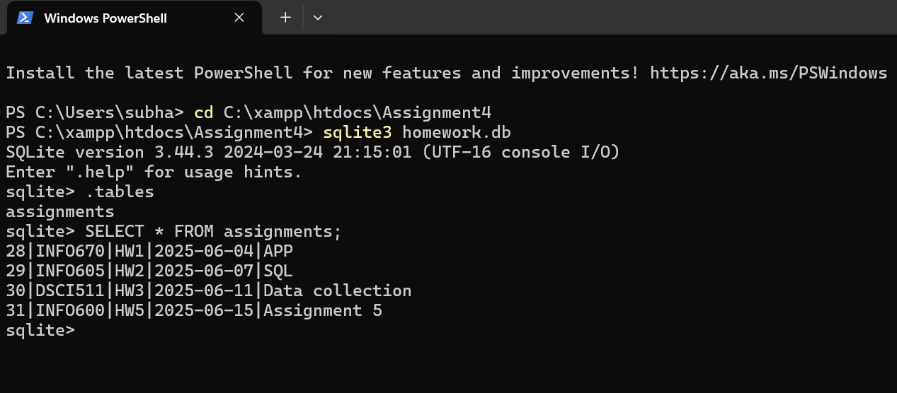

# DeadlineHub

A React Native mobile app to track assignment deadlines, built using Expo.

# Add Assignment Screen
- Enter course, assignment title, due date, and notes  
- Validates required fields before submission  
- Stores assignments in local SQLite database via PHP backend

# Screenshot1  

# View Assignments Screen
- Displays a list of assignments sorted by due date  
- Cards are color-coded:
  - 🔴 Overdue
  - 🟡 Due Soon (within 2 days)
  - ⚪ Upcoming  
- Includes urgency labels like `OVERDUE'

# Screenshot2  

# Navigation
- Navigation between Add and View screens using React Navigation

# Screenshot3  

# Screenshot4  

# Server APIs
- `addAssignment.php` handles POST requests to insert data into SQLite DB  
- `getAssignment.php` returns data as JSON for the View screen  
- Uses `homework.db` file stored locally

# Screenshot5 

# Screenshot6

# Validation and Feedback
- Prevents blank submissions  
- Displays error or success alerts accordingly  
- Shows server response message ("Assignment added”)

# Screenshot7 

# Screenshot8

# Extra Credit
- Data persistence via actual SQLite database
- Used with `PDO` in PHP for safe insert and fetch operations

# Screenshot 9

-> Server files were originally run using XAMPP in `htdocs/Assignment4/`.  
-> For submission, they are included under the `server/` folder.

