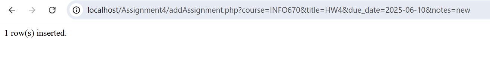
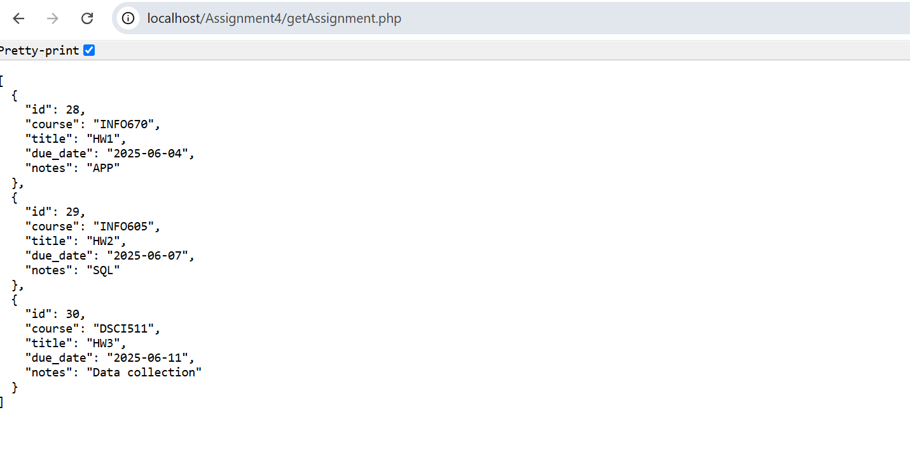

# DeadlineHub

A React Native mobile app to track assignment deadlines, built using Expo.

# Add Assignment Screen
- Enter course, assignment title, due date, and notes  
- Validates required fields before submission  
- Stores assignments in local SQLite database via PHP backend

# Screenshot1  

# View Assignments Screen
- Displays a list of assignments sorted by due date  
- Cards are color-coded:
  - 🔴 Overdue
  - 🟡 Due Soon (within 2 days)
  - ⚪ Upcoming  
- Includes urgency labels like `OVERDUE'

# Screenshot2  

# Navigation
- Navigation between Add and View screens using React Navigation

# Screenshot3  

# Screenshot4  

# Server APIs
- `addAssignment.php` handles POST requests to insert data into SQLite DB  
- `getAssignment.php` returns data as JSON for the View screen  
- Uses `homework.db` file stored locally

### addAssignment.php
Method: GET
Description: Adds a new assignment to the database.

Parameters:
course – Course name ("INFO670")
title – Assignment title ("HW4")
due_date – Due date in YYYY-MM-DD format
notes – Optional notes (e.g., "API Creation")

# Screenshot5 

### getAssignment.php
Method: GET
Description: Retrieves all assignments from the database in JSON format.

# Screenshot6

# Validation and Feedback
- Prevents blank submissions  
- Displays error or success alerts accordingly  
- Shows server response message ("Assignment added”)

# Screenshot7 

# Screenshot8

# Extra Credit
- Data persistence via actual SQLite database
- Used with `PDO` in PHP for safe insert and fetch operations

### Database Schema
The app uses an SQLite database named homework.db.

Table: assignments
Field- Type- Description
id-	INTEGER-	Primary key (auto-incremented), 
course-	TEXT-	Course name,
title-	TEXT-	Assignment title,
due_date-	TEXT-	Stored in YYYY-MM-DD format,
notes-	TEXT-	Optional notes

# Screenshot 9

-> Server files were originally run using XAMPP in `htdocs/Assignment4/`.  
-> For submission, they are included under the `server/` folder.

