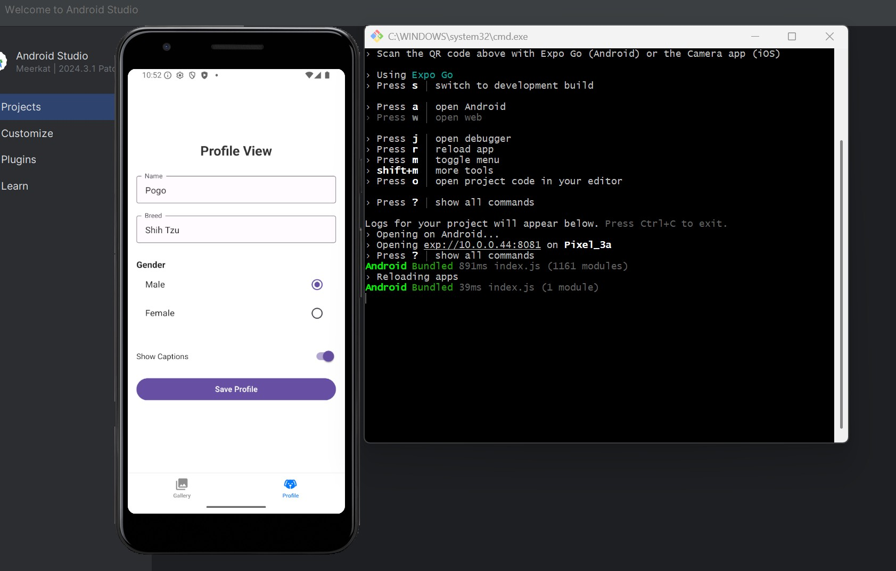
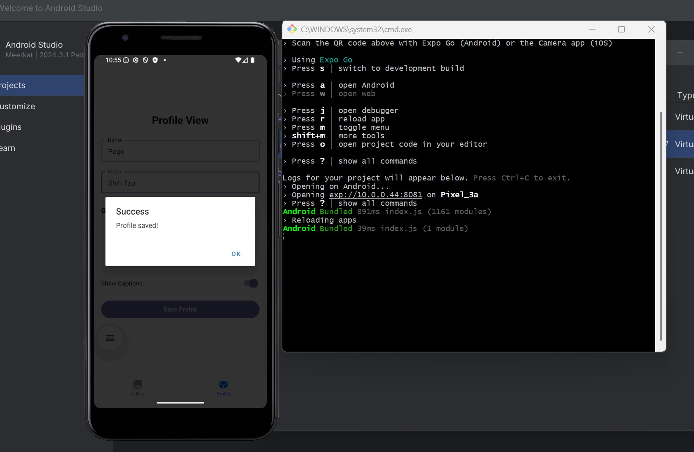
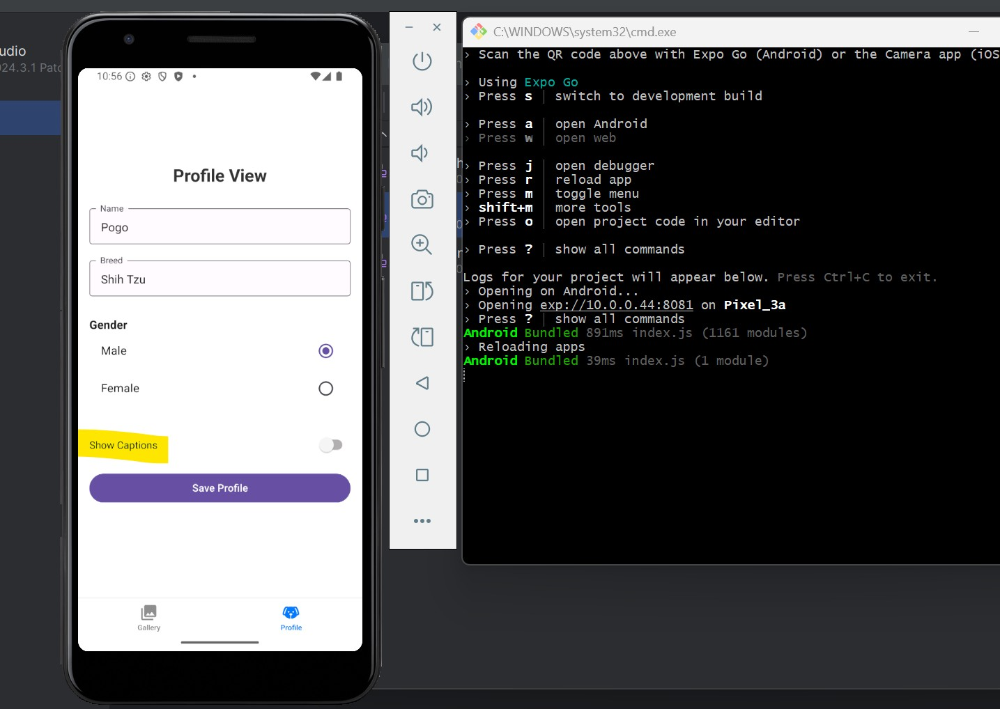

# Gallery App

A React Native mobile app built with Expo.

## Gallery Screen
- Displays image cards with captions  
- Cards highlight in gray on selection
### Screenshot1 

## Picture View Screen
- Opens selected image in full view  
- Includes caption and a back button
### Screenshot2 

## Profile Screen
- Dog’s Name and Breed as Text
- Gender as Radio button
- Switch to Show Captions
### Screenshot3

## Profile Saved
- Profile data is stored via `AsyncStorage`  
- Success message on save
### Screenshot4 

## Error Handling
- Prevents saving when any required field is blank  
- Displays an error message
### Screenshot5

## Captions Off
- Caption toggle in Profile screen is set to off 
- Setting is saved and affects gallery dynamically
### Screenshot6 

## Captions Hidden
- Cards now display without titles  
- Reflects the toggle setting correctly
### Screenshot7 

