# PawPal

PawPal is a mobile pet care assistant app built with React Native. It helps pet owners manage profiles and receive care reminders for their pets. The app is designed for simplicity, accessibility, and practical use by pet owners with one or more animals.

---

## Design & Purpose

PawPal enables pet owners to:
- Manage multiple pet profiles
- View and complete personalized medical care reminders
- Update their owner profile info securely

Targeted at busy pet owners, PawPal helps ensure that routine care like grooming and medications aren’t forgotten.

---

## Screenshots

A walkthrough of PawPal’s full functionality:

### Home Screen
- Home page to log into the system  
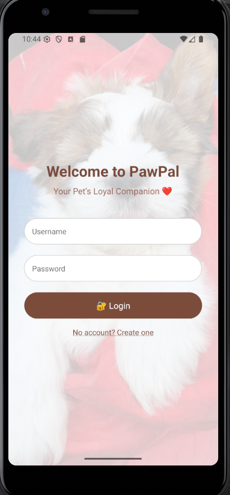

### Register Screen
- New user registration with validation  
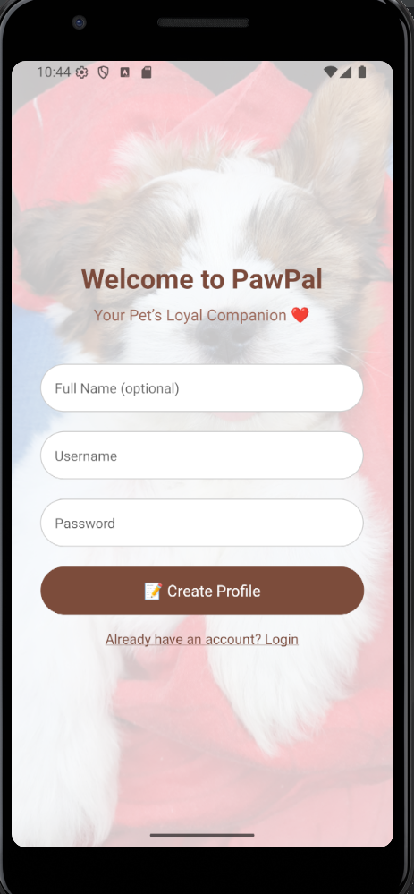

### Registered User View
- Confirmation or redirect after registration  
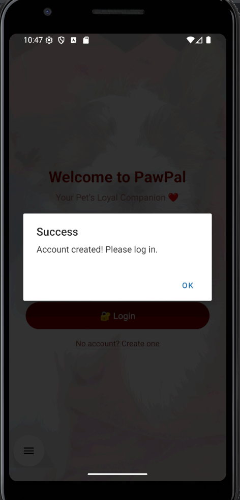

### User Profile Screen
- Welcome page with navigation to My Profile, Pets, and Reminders  
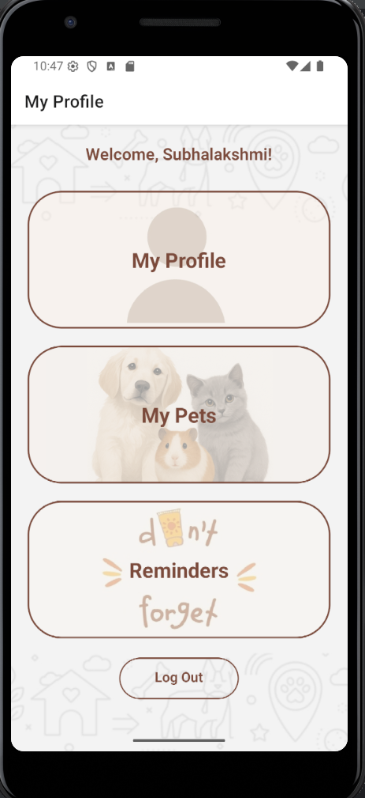

### Owner Profile Screen
- View and update name, phone number, and password  
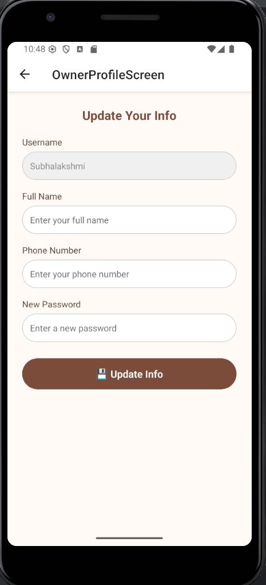

### Update Profile Screen
- Confirmation view after updating profile  
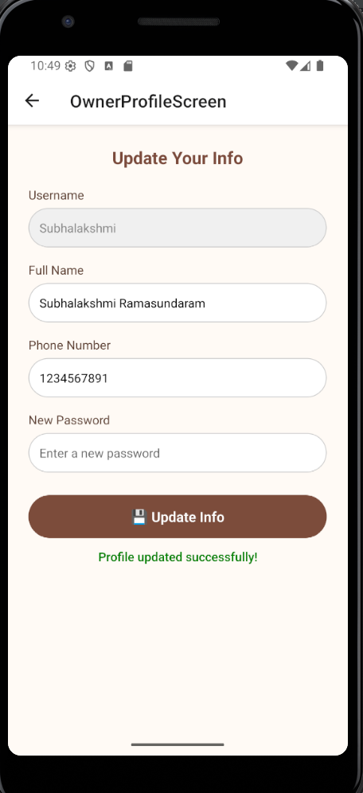

### Add Pet Screen
- Add a new pet with name, type, age, etc.  
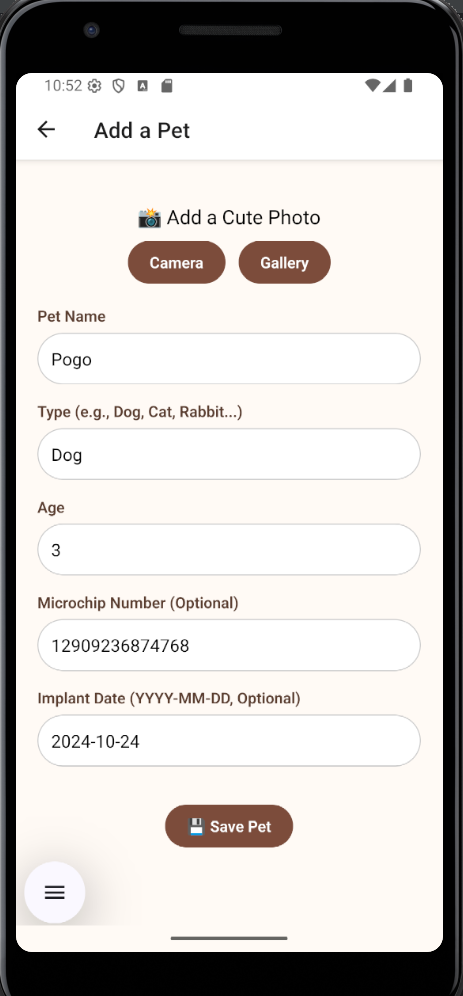

### Pet Added Confirmation
- Confirmation after adding a new pet  
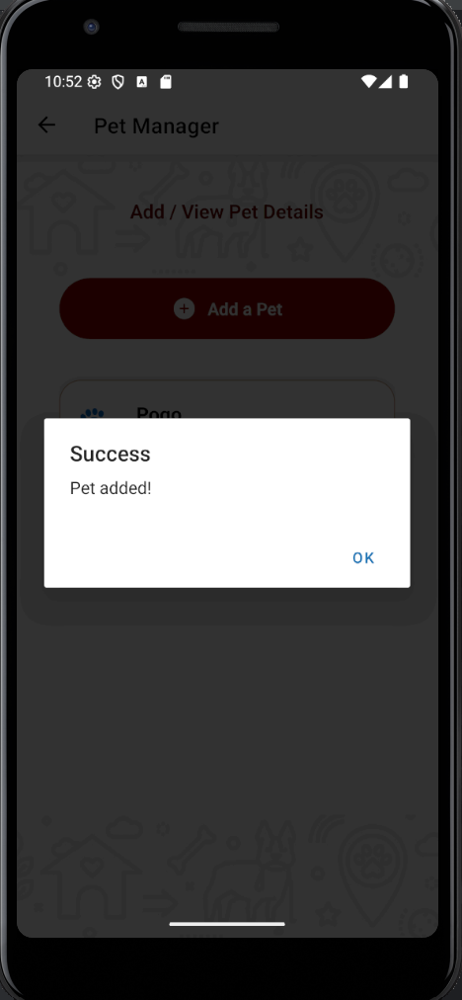

### Pet Manager Screen
- View all pets registered to the user  
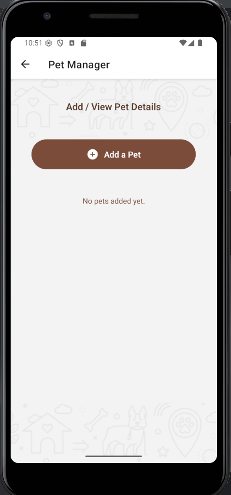

### Pet Manager After Add
- Refreshed list showing newly added pet  
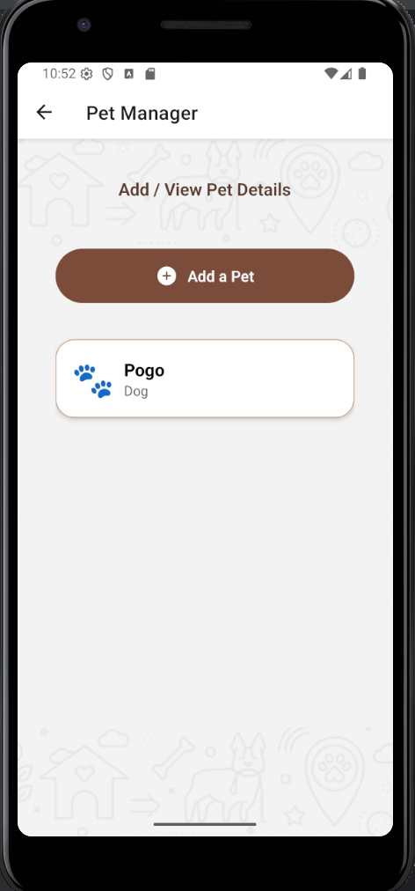

### Pet Details Screen
- View details like microchip, implant date, medical records  
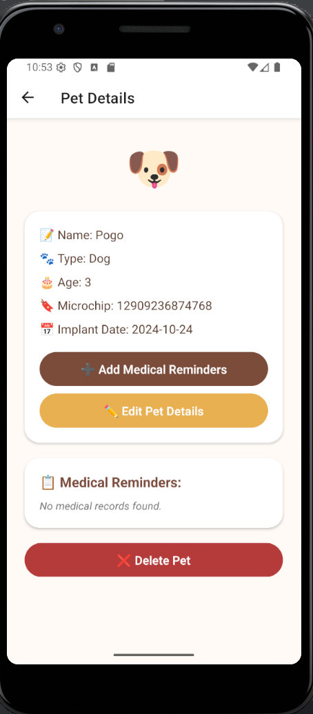

### Edit Pet Details
- Edit age, microchip number, and implant date  
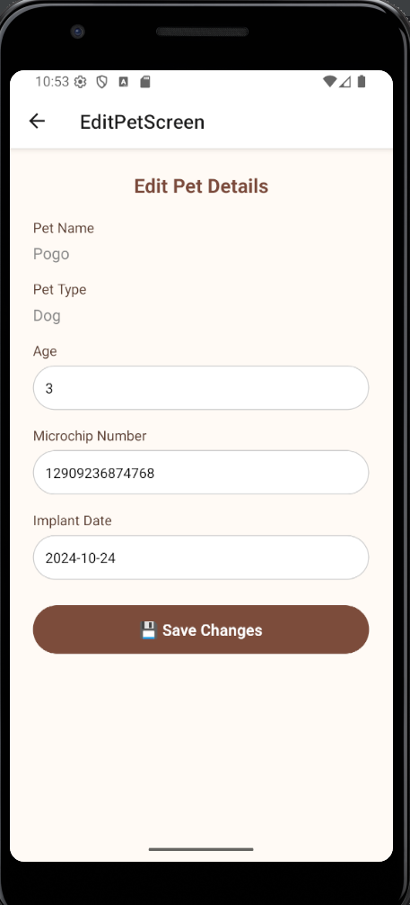

### Edited Pet Details
- Confirmation or updated view after editing  
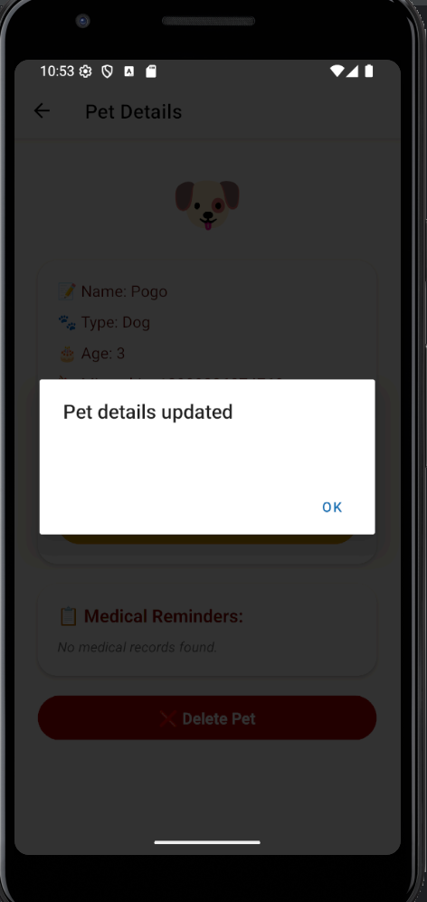

### Delete Pet
- Delete button interaction  
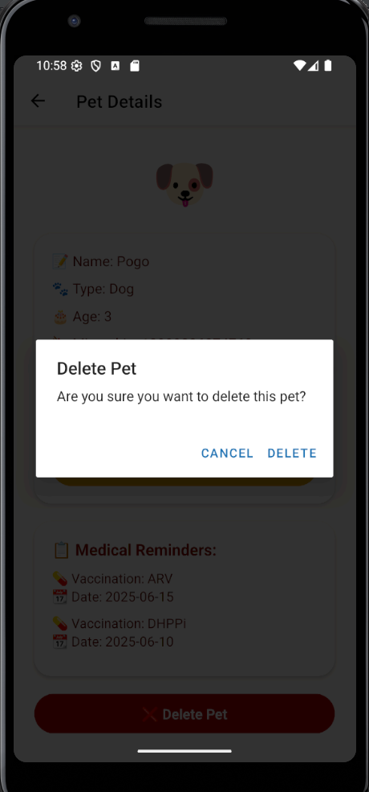

### Deleted Pet View
- Confirmation of pet deletion  
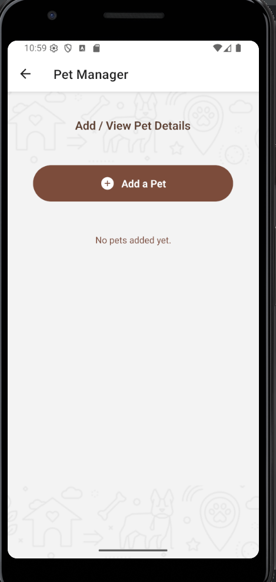

### Add Medical Reminder
- Form to add new medical/grooming reminder  
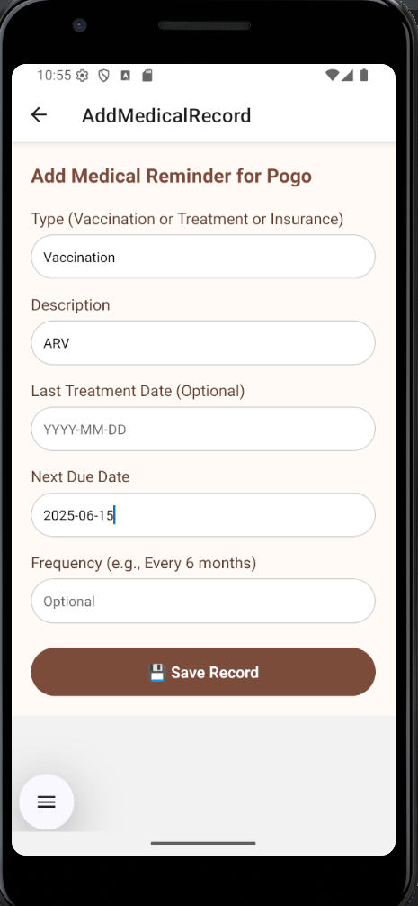

### Added Medical Reminder
- Confirmation or visual of added reminder  
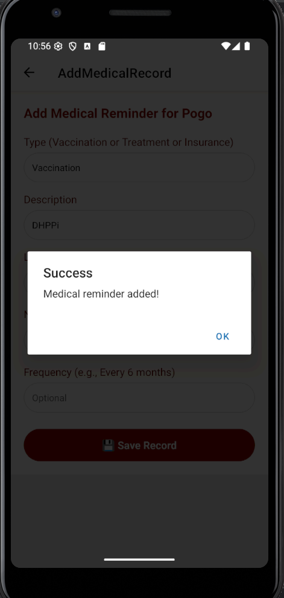

### Medical Reminders Screen
- View reminders sorted by urgency  
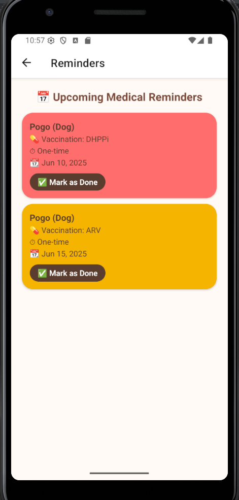

### Mark Medical Reminder Done
- Tap to mark as completed  
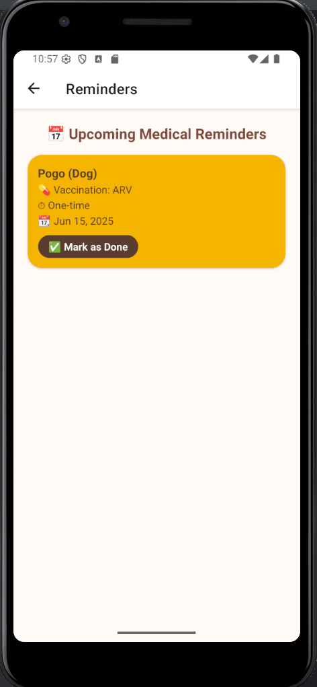

### Updated Pet Details
- View showing pet data after update  
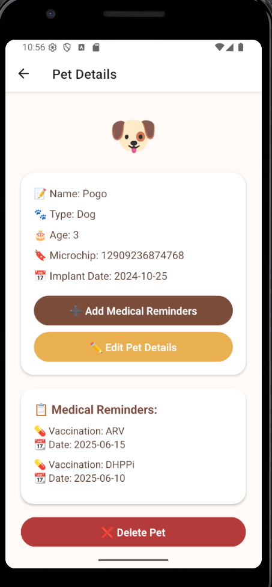
---

## Server API Design & Specification

All backend services are built using PHP and integrated with an SQLite database.

### `register_user.php`
- **Method**: `POST`
- **Params**: `username`, `password`, `name`, `phone`

### `login.php`
- **Method**: `POST`
- **Params**: `username`, `password`

### `get_user.php`
- **Method**: `GET`
- **Params**: `username`

### `update_user.php`
- **Method**: `POST`
- **Params**: `username`, `name`, `phone`, `password`

### `add_pet.php`, `get_pets.php`, `delete_pet.php`, `update_pet.php`, `get_pet_detail.php`
- Manage pet profiles

### `get_reminders.php`, `mark_reminder_done.php`
- Manage grooming/medical reminders

---

## Medical Reminders Feature

The **Medical Reminders** screen shows upcoming pet care tasks such as:
- Nail trimming
- Hair grooming
- Vaccination schedules
- Regular checkups
- Insurance payments

Reminders are shown in order of urgency (soonest due date first), and users can **mark tasks as done** with a tap.

### `get_reminders.php`
- **Method**: `GET`
- **Params**: `username`
- **Returns**: Sorted list of active reminders by urgency

### `mark_reminder_done.php`
- **Method**: `POST`
- **Params**: `reminder_id`
- **Marks a reminder as complete**

---

## API Call Example

**Endpoint:**  
`GET http://localhost/PawPal/register_user.php?username=testuser&password=12345`

**Response:**
```json
{
  "success": true,
  "message": "User registered successfully"
}```
---

## Experiences

### Key Features Implemented
- Frontend with 7+ screens using React Native
- Owner login/register and profile updates
- Pet profile CRUD operations
- Urgent medical reminder tracking

### Techniques Used
- Navigation and route params
- RESTful fetch to PHP APIs
- SQLite backend and hashed password security
- List filtering and conditional rendering

### Challenges
- Expo dev client compatibility with notifications
- Real-time syncing of reminder updates
- Maintaining platform consistency

### Future Plans
- Add calendar integration for reminders
- Let users create custom reminder types
- Profile images and cloud backup

---

## Project Structure

```
screens/
  ├── HomeScreen.js
  ├── UserProfileScreen.js
  ├── OwnerProfileScreen.js
  ├── AddPetScreen.js
  ├── PetManagerScreen.js
  ├── PetDetailScreen.js
  ├── EditPetScreen.js
  ├── ReminderScreen.js
  ├── AddMedicalRecordScreen.js

htdocs/PawPal/
  ├── connect.php
  ├── register_user.php
  ├── login.php
  ├── get_user.php
  ├── update_user.php
  ├── add_pet.php
  ├── update_pet.php
  ├── delete_pet.php
  ├── get_pet_detail.php
  ├── get_pets.php
  ├── get_reminders.php
  └── mark_reminder_done.php
  ├── get_pet_records.php
  └── add_medical_record.php
```
All backend files are copied to server_php folder for submission
---

## Team

- Subhalakshmi Ramasundaram (solo project)
