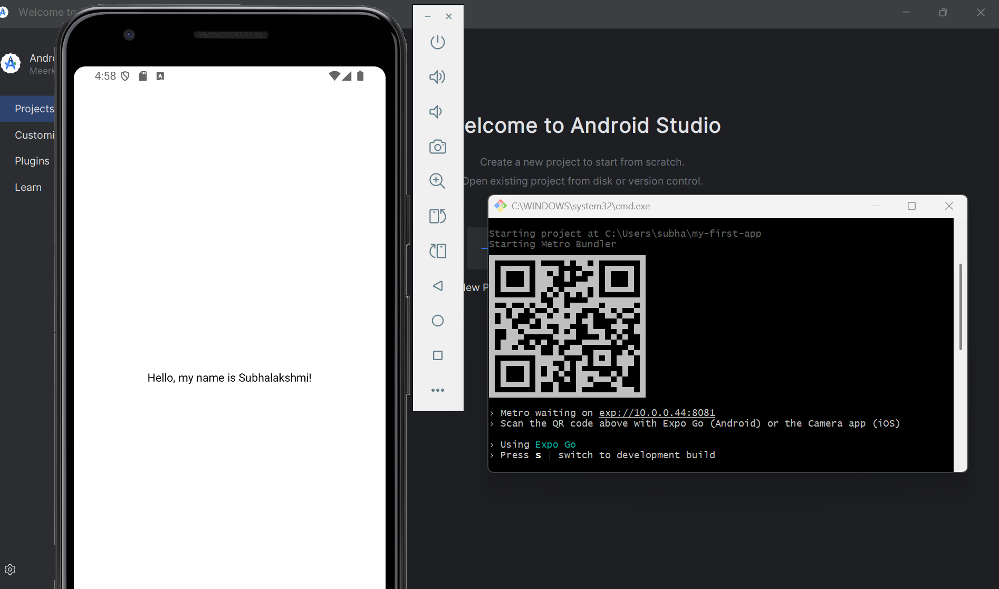
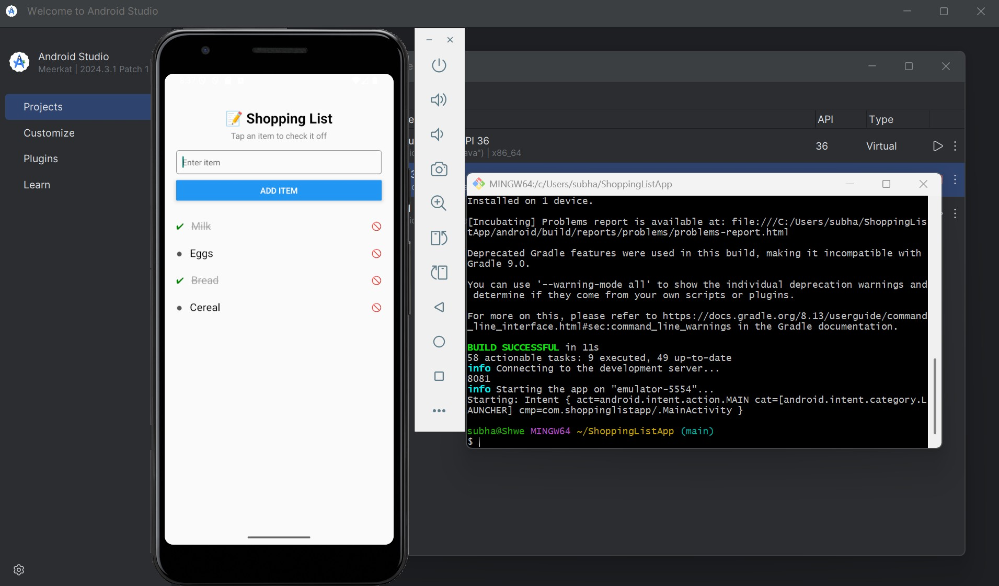
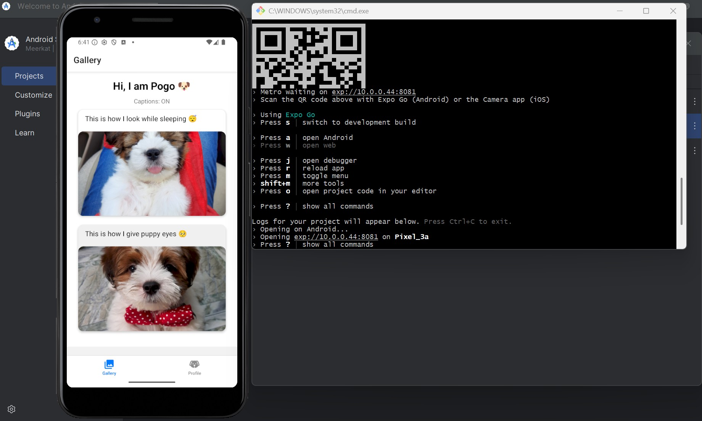

# Info 670- Assignments

# Assignment 1: App screenshot
This app was built using Expo and displays my name.

# Assignment 2: Shopping List App
This app was built using React Native.
Allows users to:
- Add shopping list items
- Tap to mark them as complete ✔
- Strike-through completed items
- Delete items with a 🚫 icon

# Assignment 3: Gallery App
This app was built using React Native and Expo.

Highlights:
- Displays a image gallery
- Opens full-screen image view
- Highlights image when selected
- Customizable profile screen
- Stores profile data
- Error handling in profile screen
- Toggle controls caption visibility in gallery

### This is a preview. Full screenshots are inside the /GalleryApp folder

# Assignment 4: DeadlineHub
This app was built using React Native (Expo), PHP, and SQLite.

Highlights:
- Adds assignments with course, title, due date, and notes
- Displays assignments sorted by nearest due date
- Color-coded cards for urgency (red/yellow/white)
- Shows labels like OVERDUE, DUE TODAY, etc.
- Validates required fields before saving
- Sends/receives data using PHP server and SQLite DB
- Navigation between Add and View screens
- Bonus: Used PDO for database integration

### This is a preview. Full screenshots are inside the /DeadlineHub folder
